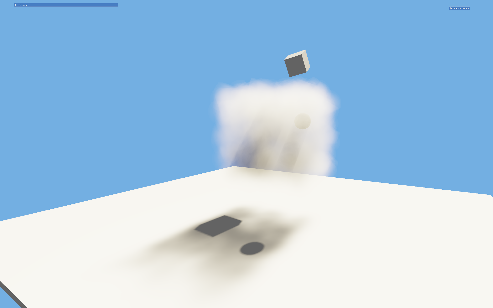

# Interval Shaded Volumetrics

## Building
- Ensure that `vcpkg` is integrated with Visual Studio by running `vcpkg integrate install` from a Developer Command Prompt. 
- Run `GetLibraries.ps1` to set up other dependencies.
- After that, simply build and run the solution.